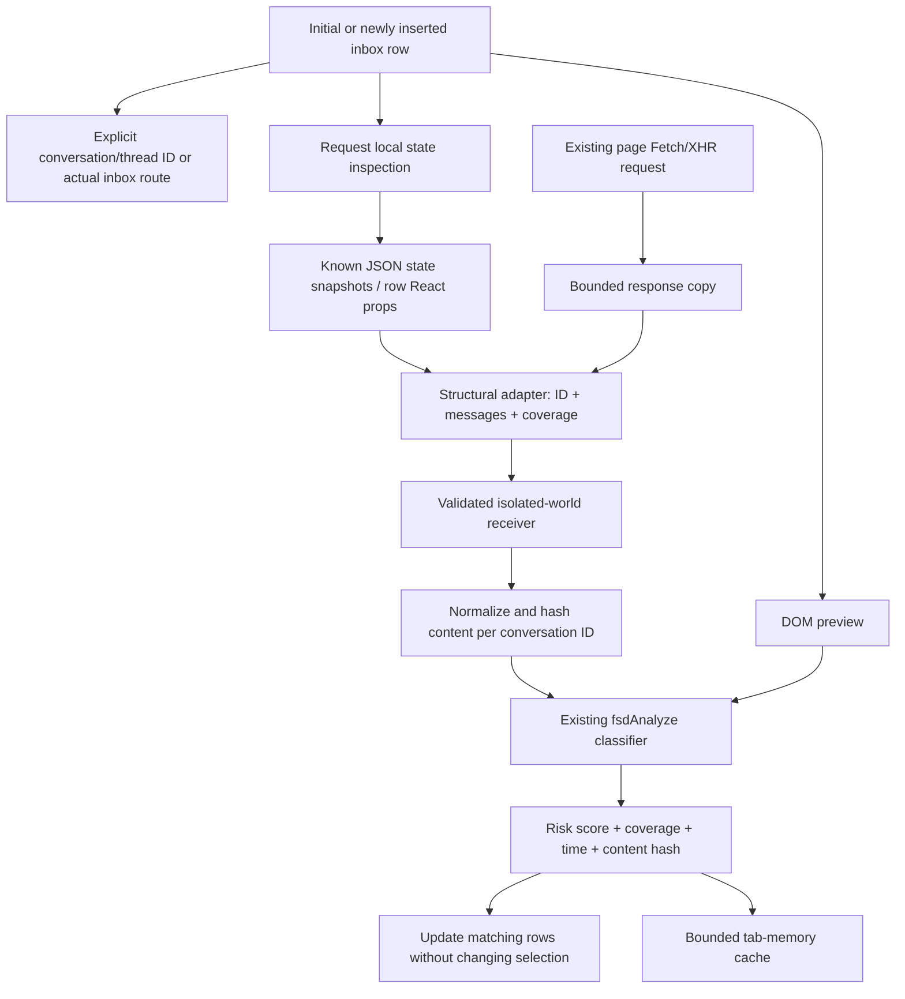

# Inbox background detection

## What was verified, and what was not

The repository's extension architecture and browser fixtures were inspected. There is no authenticated Fiverr browser session, saved inbox DOM, HAR, or real message-response sample in this workspace. The adapters below support explicit structural formats and are tested using synthetic Fiverr-origin responses. They are **not a claim that Fiverr currently uses these exact field names or endpoints**. No speculative Fiverr endpoint was called or added to the extension.

If the live site supplies messages only after opening a conversation, a passive observer cannot recover those unavailable messages. Those rows correctly remain unknown. To extend an unsupported live format, capture a redacted response structure or row props structure and add a narrowly scoped adapter in `extension/page-data.js`.

## Root cause

`manifest.json` previously loaded only isolated-world content scripts at document end. `message-detector.js` observes message nodes and conversation rows; `message-extractor.js` extracts incoming message text and links. Opening a chat causes Fiverr to insert its message nodes. `content-script.js:scan()` then calls the existing `fsdAnalyzeMessage()` classifier and passes the resulting scores to `scanConversations()`.

Before opening, `scanConversations()` had only `rowPreview()` and cached risk scores. It neither observed responses nor read page state. A row containing only a name/avatar/time had no message evidence. Renaming Checking to No preview did not obtain that missing evidence. The worker's `FSD_CONVERSATION_RISK` handler retrieves risk metadata, not conversation text. The previous username-derived identity was also unsuitable for background association.

## Files and responsibilities

| File | Change |
| --- | --- |
| `manifest.json` | MAIN-world parser/observer and isolated receiver at document start; existing detector remains at document end. |
| `extension/page-data.js` | Bounded, getter-free structural adapters; explicit conversation IDs, routes, messages, previews and metadata. |
| `extension/page-observer.js` | Passive Fetch/XHR observation; bounded response clones; selected state snapshots and row React props; early-response replay. |
| `extension/conversation-data.js` | Validated bridge, ID mapping, normalized text, SHA-256 content hashes, bounded in-memory results, targeted notifications and debug logs. |
| `extension/content-script.js` | Reuses existing classifier/badges; consumes background data; removes username-derived IDs; handles partial coverage; deduplicates cloned badges and preview analysis. |
| `extension/message-detector.js` | Recognizes/observes stable thread IDs alongside conversation IDs. |
| `extension/background.js` | Injects both worlds into already-open tabs on extension initialization; existing metadata-only storage remains. |
| `tests/inbox-data.cjs` | Browser tests for all seven requested scenarios, passive network behavior and privacy. |
| `tests/extension-monitor.cjs` | Benign-preview tests now expect unknown instead of unsupported Safe. |
| `tests/installed-extension.cjs` | Real installed MV3 test of MAIN-to-ISOLATED communication and document-start capture. |
| `package.json` | Includes the new browser regression suite in `npm test`. |

The complete code is in these files; `reports/inbox-background-updated-source.md` contains full copies of the changed runtime/configuration/test files for review. No scam rules or overall UI design were changed.

## Data flow



The service worker is not needed to read raw background message data. New message text stays in the page/content-script process and is never sent to the worker or persisted. Existing storage continues to use risk metadata and protected references.

## Layered acquisition

1. Existing DOM preview selectors and fallback text extraction run first. Actual opened-chat message detection is unchanged.
2. A coalesced request reads `__INITIAL_STATE__`, `__PRELOADED_STATE__`, `__NEXT_DATA__`, JSON scripts with ID `__NEXT_DATA__` or `data-state`, and own `__reactProps$…` data properties attached to the requested row. It does not crawl the Fiber graph, invoke getters, or enumerate arbitrary window objects.
3. Fetch is wrapped at document start. The original promise/response is returned to Fiverr. A clone is read asynchronously, capped at 512 KiB. Only successful same-origin JSON responses on paths containing inbox/conversation/message/thread/graphql are considered. XHR is observed after load; its body is not modified. JSON-response XHR objects use bounded structural traversal, including when Content-Length is absent.
4. Supported shapes include `conversation_id`, `conversationId`, `thread_id`, `threadId`; `id` under an explicit conversation/thread collection; message arrays and GraphQL nodes/edges; last/latest message objects; and identified individual message events. Actual inbox URLs can alias a response ID. A participant name is never manufactured into a URL or conversation ID.
5. Unsupported, empty, oversized, ambiguous, HTML-only, or inaccessible data remains unknown. There is no click, navigation, endpoint replay, guessed request, invented credential, token extraction or retry loop.

These are conservative adapters, not a universal parser. Cross-origin APIs, WebSocket traffic, arbitrary closure-only stores, HTML bodies, different field names, and props attached only to ancestor/component internals need separately verified adapters. The extension does not fetch inaccessible history.

## Coverage and risk

- Actual nonempty available message data may produce Safe using the existing detector. This means no matching risk in the messages available to the extension, not proof that the entire historical conversation is safe.
- A preview can produce an existing suspicious/high-risk score, but a benign preview alone is insufficient for Safe and remains No preview/unknown. Badge metadata records `data-source` and `data-coverage`; tooltips describe limited coverage.
- Empty message arrays, names, avatars, timestamps, and legacy zero-score caches do not establish Safe.
- Existing recent higher-risk retention remains: a later benign snippet/message does not erase earlier high-risk evidence during the 30-minute retention period.
- Existing middle-tier risk classification is preserved rather than forcing the classifier into a binary result.

## Dynamic rows and deduplication

The existing MutationObserver batches relevant row/message mutations with its 150 ms deadline. It handles initial load, scroll-added rows, identity changes, text changes, and SPA rerenders. Extension-owned badges are ignored. Newly discovered or changed rows request one coalesced local-state inspection. The additional state observer only schedules work for supported JSON-script insertion/text changes; it does not rescan the DOM for ordinary mutations.

Response/state updates notify the content script with affected conversation IDs after a 50 ms batch window. Only matching known rows are updated. SHA-256 hashes of normalized content plus coverage are cached per conversation ID; identical data on a replacement DOM node does not rerun the classifier. Separate conversation IDs with identical text retain independent results. DOM previews also reuse a bounded content-result cache across row replacement.

Caches, pending records, response size, traversal depth/node count, and message count/length are bounded. Stop clears the new in-memory cache and pending work. Asynchronous generation/revision checks prevent disabled or superseded analysis from publishing. A bounded early-response buffer prevents startup timing from losing data before the isolated receiver is ready. No periodic network retries run.

## Debug mode

Off by default. In the extension's **service worker DevTools console** (Chrome extensions page → this extension → service worker), run:

```js
await chrome.storage.local.set({ fsd_debug: true });
```

Open the Fiverr page's DevTools console and filter for `[ScamDetector]`. Logs cover conversation detection, hashed conversation ID, DOM/state/fetch/XHR source, whether data was found, message count, risk, and UI updates. Unsupported source structures produce a fixed diagnostic without dumping responses. IDs are hashed in logs; message text, sender names, authentication headers and tokens are not logged.

Disable with:

```js
await chrome.storage.local.set({ fsd_debug: false });
```

A MAIN-world bridge shares a trust boundary with the page: origin/schema checks constrain input, but the page can fabricate data just as it can alter its DOM. The bridge is analysis-only; it cannot issue privileged extension commands or request network access.

## Testing checklist

Run `npm run build:extension`, `npm run check:extension`, and `npm test`. Reload the unpacked extension from `dist/scam-finder`, then refresh Fiverr so document-start observers catch initial requests.

- [ ] Initial five-row inbox: state/fetch evidence gives risk/safe results without clicks; absent data remains unknown.
- [ ] Scroll: inserted rows receive badges and resolve from available identified data.
- [ ] Rerender: one badge per row; known results preserved; classifier count unchanged for identical content.
- [ ] New message: changed response content reanalyzes only the affected ID and updates its badge.
- [ ] Missing or benign preview-only data: no false Safe.
- [ ] Another chat selected: URL, selected conversation, focus and scroll are untouched; no simulated clicks.
- [ ] Identical text in distinct conversations: separate correctly associated status entries.
- [ ] Fetch/XHR response bodies remain readable by Fiverr; extension creates no additional requests.
- [ ] GraphQL-shaped JSON and late JSON state snapshots update existing rows.
- [ ] Stop protection: no further response analysis; restart can inspect state again.
- [ ] Privacy: storage contains no captured message text or sender names.
- [ ] Live Fiverr validation: use debug source/coverage logs to confirm actual payload compatibility. If no adapter matches, obtain a redacted structural example before extending the parser; do not equate a passing fixture with verified live-site support.

Chrome's documented MAIN/ISOLATED worlds and document-start behavior: https://developer.chrome.com/docs/extensions/develop/concepts/content-scripts
